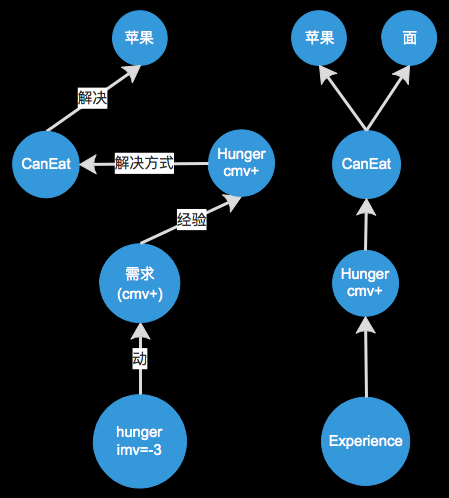
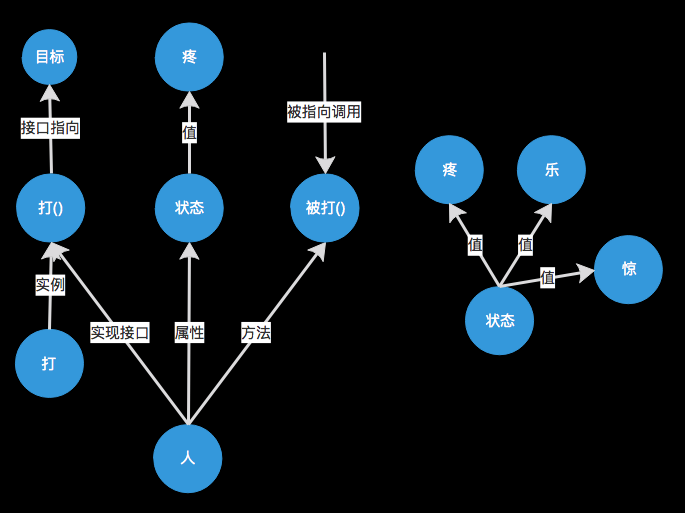
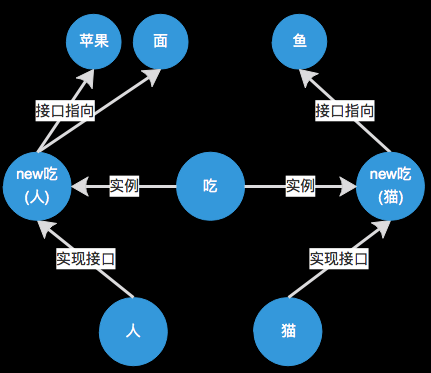

# 思维与神经网络整合开发实践

<!-- TOC depthFrom:1 depthTo:6 withLinks:1 updateOnSave:1 orderedList:0 -->

- [思维与神经网络整合开发实践](#思维与神经网络整合开发实践)
	- [n10p1 Net存String](#n10p1-net存string)
	- [n10p2 SQL备查整理](#n10p2-sql备查整理)
	- [n10p3 思维的动2](#n10p3-思维的动2)
	- [n10p4 OOP转移到神经网络实践](#n10p4-oop转移到神经网络实践)

<!-- /TOC -->

     

## n10p1 Net存String
`CreateTime 17.12.25`

| 前言 >> |
| --- |

|  |
| --- |
| 将思维与mindValue深度集成,并将先天神经网络删除后,整个神经网络有了很大改变,此节用于整理`字符串`在神经网络中的基本存储结构 |

| 示图 >> |
| --- |

| 简 | 全 |
| --- | --- |
|  |  |

| 注: | `示图全` 为成熟阶段,我们要区分其中: |
| --- | --- |
| 1 | 哪些成份是先天具有的, |
| 2 | 哪些是后天思维轻易且必然形成的, |
| 3 | 哪些是后天思维不一定想到的; |
| 注: | 先天不存在字母、单词、数字的概念; |
| 注: | 先天存在属性与值的概念; |

| 思维方式接入 >> |
| --- |

|  |  |
| --- | --- |
| 类比 | 类比的细腻度依赖与算法等基础,而类比的结果产生归纳及`归纳下的归纳实体` 形成层级归纳结构 |
| 归纳 | `归纳` 在神经网络中体现为独立的`层级结构`,是神经网络中的`索引`,其结构越分层明确且详细,越易于检索; |
| 统计 | 由节点间的关联自动形成与使用,有几条规则决定其变化 |

     

## n10p2 SQL备查整理
`CreateTime 17.12.25`

| 前言 >> |
| --- |

|  |
| --- |
| 神经网络数据库因其结构与以往不同,有强大的关联及索引能力,在sql上也会比以往更加多变强大,此节用于跟随所有开发用到结构需求,在此留下sql记录;`备查及整理于此` |

     

## n10p3 思维的动2
`CreateTime 17.12.26` `参考n9p20`

| 复杂的动 >> |
| --- |

|  | 借助数据,有了思维方式 |
| --- | --- |
| 思维`动`的方式 | 如:穷举式帮助`归纳`检索 |

| 思维数据的神经网络存储 >> |
| --- |

|  |  |
| --- | --- |
| 思维方式 |  |
| law | 类比发现`规律`,而规律让类比产出结果; |
| can | 也是`归纳`的一种 |
| logic | 是`can`的实例化形式,即: Logic l = new Can(); |
| isa | 是`归纳` |
| valueIs | 是`属性值` |
| 思维经验 | 似下图 |

| 思维经验示图 >> |
| --- |

| 类似String | Experience |
| --- | --- |
|  |  |

     

## n10p4 OOP转移到神经网络实践
`CreateTime 17.12.27` `参考n10p1 n10p2 n10p3`

| 问题:分析如下内容,如何建立`归纳`结构? >> |
| --- |

| 1 |  |
| --- | --- |
|  | 人能被打 |
|  | 人会疼 |
|  | 人被打会疼 |
|  |  |

| 2 |  |
| --- | --- |
|  | 人能吃 |
|  | 苹果能被吃 |
|  | 人能吃苹果 |

| 3 |  |
| --- | --- |
|  | 人吃面和苹果 |
|  | 猫吃鱼 |
|  |  |

| 注: |  |
| --- | --- |
|  | `能`:输出->指向目标 |
|  | `会`:状态->可变化 |
|  | `能被`:输入->被指向为目标 |

| `归纳`结构构建 >> |
| --- |

|  |  |
| --- | --- |
| 1 | 从数据类型上,可以作判断的,可以自动进行先天指定的结构构建 |
| 2 | 从类比结果,可以作先天指定的结构构建; |

       
