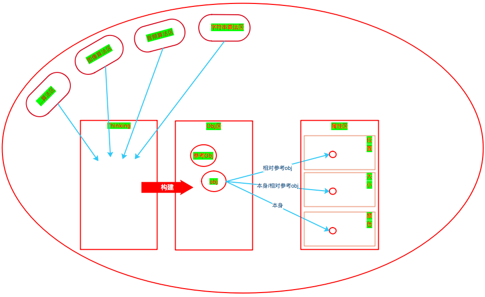

# 思维

<!-- TOC depthFrom:1 depthTo:6 withLinks:1 updateOnSave:1 orderedList:0 -->

- [思维](#思维)
	- [n9p1 思维控制器与神经网络合并部分](#n9p1-思维控制器与神经网络合并部分)
	- [n9p2 思维控制器独立部分](#n9p2-思维控制器独立部分)
	- [n9p3 Mood与MindValue](#n9p3-mood与mindvalue)
	- [n9p3 自我](#n9p3-自我)
	- [n9p4 事务控制器2](#n9p4-事务控制器2)
	- [n9p5 SMG软件架构2](#n9p5-smg软件架构2)
	- [n9p6 思维方式的先后天](#n9p6-思维方式的先后天)
	- [n9p7 想像力2](#n9p7-想像力2)
	- [n9p8 AINet(算法分区 & 多维分区)](#n9p8-ainet算法分区-多维分区)

<!-- /TOC -->

     

## n9p1 思维控制器与神经网络合并部分
`CreateTime 17.11.20`

| 思维的神经网络存什么 >> |
| --- |

|  | desc |  |
| --- | --- | --- |
| 1 | 存task | task的神经网络存储，依关联强度自然排序 |
| 2 | 存解决问题的记录 |  |

     

## n9p2 思维控制器独立部分
`CreateTime 17.11.20`

| 思考分离到AIThinkingRule中的部分到底是哪些 >> |
| --- |

|  | title | desc |
| --- | --- | --- |
| 1 | 逻辑源则 | 所有数据的思考要回归以数据为准,代码只是辅助数据解决不了的事情; |

     

## n9p3 Mood与MindValue
`CreateTime 17.11.20`

| 所有情感对应两级性的接口。抽象为mindValue+- >> |
| --- |

     

## n9p3 自我
`CreateTime 17.11.20` `参考: n9p1`

| 自我循环圈概念 >> |
| --- |

| title | desc |
| --- | --- |
| 概念 | 自我状态(五感状态与mindValue状态)的神经网络化形成自我; |
|  |  |

| 自我循环圈之Mood >> |
| --- |

|  |
| --- |

| 自我循环圈之思维数据 >> |
| --- |

| NULL |
| --- |

     

## n9p4 事务控制器2
`CreateTime 17.11.21` `参考: n8p5`

| 功能 >> |
| --- |

|  | 功能 | 描述 |
| --- | --- | --- |
| 1 | 归整Input | 接收AIAwareness的Input并传递给AINet |
| 2 | 兴奋仰制 | 当AINet反射算法有深度时,负责发出兴奋或抑制信号,从而改变AINet工作; |
| 3 | 思维事务控制器 | 当ThinkingRule提交事务时,作为事务控制器; |
| 4 | 联想 | 区域点亮 |
| 5 | 无意识事务 | 不断发送兴奋,不断作无意识思维的类比碰撞,直到ok |

     

## n9p5 SMG软件架构2
`CreateTime 17.11.22` `参考: n8p1 n8p4 n8p6 n8p9`

| 示图 >> |
| --- |

|  |
| --- |

     

## n9p6 思维方式的先后天
`CreateTime 17.11.23` `参考: n9p1 n9p2`

| 简介 >> |
| ------- |

| desc |
| --- |
| 思维在神经网络中的内心活动,就像黑箱,使数据的整理与智能的体现有了完善的熵减规则;为此,神经网络的先天结构定义本身也就成为了先天思维的实现方式,而思维本身的再神经网络化,又成了其后天; |

| 先天 >> |
| --- |

|  | desc | 栗子 |
| --- | --- | --- |
| 1 | 神经网络的数据逻辑logic(数据根据时间线x产生的变化) | `1-2`,`2-3`,`4-5`,`3-4` |
| 2 | 神经网络的数据规律raw() | `1-2`,`1-2`,`1-2` |

| 后天 >> |
| --- |

|  | desc | 栗子 |
| --- | --- | --- |
| 1 | multi(将多个常识,经验等联合成链等方式进行思考的能力) | `1-2-3` |
| 2 | 神经网络的数据经验experience(经验等实现的思维习惯) | `1-2-3` |
| 3 | 想像力辅助思维(想像力取决于数据与常识,一个色盲是无法想像识别不到的颜色的;) | `1-2-3-4-5` |

     

## n9p7 想像力2
`CreateTime 17.11.23` `参考: n8p2 n8p15`

| 概念 >> |
| --- |

| desc | 参考 |
| --- | --- |
| `想像力` 是1或多次:`事务+Think` 的过程; | 事务步骤 `参考: n8p5` |

| 想像力与事务 >> |
| --- |

| desc |
| --- |
| 想像力需要足够的细腻多维的数据;如:obj与`属性`与`属性的属性如:空间等` |

     

## n9p8 AINet(算法分区 & 多维分区)
`CreateTime 17.11.24` `参考: n8p10`

| 示图 >> |
| --- |

|  |
| --- |
| 1. 算法分区本身不具备识别功能,只有基本的并行运算功能 |
| 2. Thinking是真正的Net构建者,也是真正的AIDataNode生产者; |

     
***
